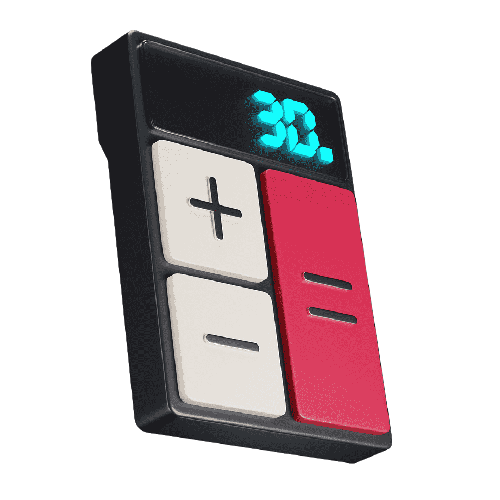
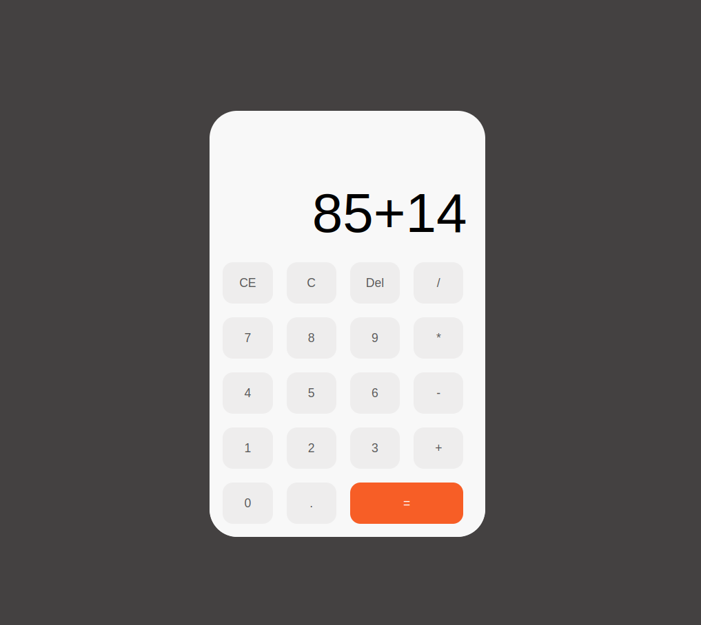

  
  <h1>Calculadora em Javascript</h1>

### Um app de calculadora feito em HTML5, CSS3 e Javascript Puro, ao decorrer dos meus estudos e desenvolvimento de habilidades, eu irei atualizando ela, a meta é desenvolver ela em React JS.

 

## Tecnologias

 

